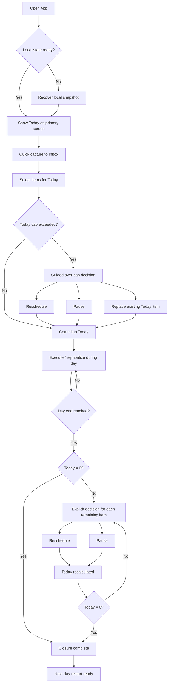
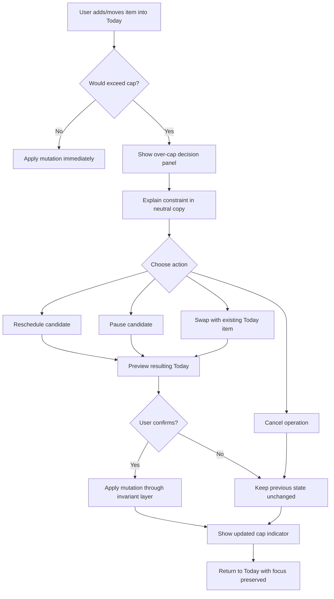

---
stepsCompleted:
  - 1
  - 2
  - 3
  - 4
  - 5
  - 6
  - 7
  - 8
  - 9
  - 10
  - 11
  - 12
  - 13
  - 14
inputDocuments:
  - C:\laragon\www\task-ino\_bmad-output\planning-artifacts\prd.md
  - C:\laragon\www\task-ino\_bmad-output\project-context.md
workflowType: 'ux-design'
project_name: 'task-ino'
user_name: 'Stefano'
date: '2026-02-23'
lastStep: 14
status: 'complete'
completedAt: '2026-02-23'
---

# UX Design Specification task-ino

**Author:** Stefano
**Date:** 2026-02-23

---

<!-- UX design content will be appended sequentially through collaborative workflow steps -->

## Executive Summary

### Project Vision

`task-ino` is a local-first daily planning system designed to reduce cognitive load while increasing real user control over personal planning data.
The core UX loop is: `Inbox -> Finite Today -> Explicit Closure`, with interactions that remain fast, non-blocking, and reliable even offline.
**Today is a finite, capped list, never an infinite default backlog.**
**Guiding principle: help users decide what to do today in under two minutes while maintaining full control of their system.**

### Target Users

- **Privacy-aware professional:** seeks data sovereignty and control without sacrificing speed.
- **Convenience-first planner:** wants to decide today's plan quickly, without noise or feature overload.
- **Operator/support roles (secondary):** need observability and non-destructive recovery workflows.

### Key Design Challenges

- Translating hard invariants (Today cap, required closure, local source-of-truth) into simple, intuitive interactions.
- Preserving planning continuity when sync state changes without degrading runtime clarity.
- Balancing speed (quick add, fast reprioritization) with decision safety (no silent overflow or implicit carry-over).
- Maintaining keyboard-first desktop accessibility without adding friction to core planning flows.
- Preventing sync and technical states from entering the primary decision-making flow.

### Design Opportunities

- Establishing the 2-Minute Planning Loop as a recognizable and measurable UX signature.
- Using minimal but explicit status feedback to reinforce trust in local-first + optional sync behavior.
- Framing guardrails as decision support, not punitive constraints.
- Differentiating through calm UX that translates technical complexity (E2EE/local-first) into user clarity.

## Core User Experience

### Defining Experience

The UX core of `task-ino` is a closed, finite daily planning loop: users open, decide, execute, and close without drift.
The primary UX priority is making "what should I do today?" fast, clear, and low-friction.
**The primary app screen is Today, not Inbox.** Inbox is intake; Today is decision.

**Core action to optimize above all else:**
move from uncertainty to a clear daily plan in under two minutes (`Inbox -> Finite Today -> Explicit Closure`).

### Platform Strategy

- **Primary platform:** web app (SPA/PWA) with authenticated shell.
- **Interaction model:** desktop keyboard-first with coherent touch/mobile support.
- **Public surface:** MPA/SSG pages (landing/pricing/docs/privacy/support).
- **Offline requirement:** planning runtime remains fully usable offline; sync stays asynchronous and optional.
- **Constraint:** technical state (sync/network) must not interrupt decision flow.

### Effortless Interactions

The interactions that must feel zero-thought:

- Fast task capture in Inbox (quick add always available).
- Building Today under cap with immediate feedback.
- Single and bulk rescheduling without friction.
- End-of-day closure with explicit decisions for all remaining items.
- State recovery/continuity without destructive reset.

Eliminations versus common competitor patterns:
- No default infinite backlog experience.
- No server dependency to decide the daily plan.
- No blocking sync UI for core planning actions.
- No ambiguity between active plan and historical archive.

### Critical Success Moments

Make-or-break moments:

1. **First 2 minutes:** user can decide today’s plan immediately.
2. **Over-cap moment:** system supports explicit decision-making without chaos.
3. **Sync variability moment:** plan clarity remains stable during/without sync.
4. **End-of-day closure:** user ends with control (`Today = 0` or explicit resolution).
5. **Recovery moment:** inconsistencies are resolved without trust collapse.

### Experience Principles

1. **Finite by design:** Today is always finite, never an unlimited default container.
2. **Decide before manage:** daily decision quality matters more than organizational complexity.
3. **Local-first clarity:** planning state is always understandable and actionable locally.
4. **Guardrails as support:** constraints guide decisions, they do not punish users.
5. **Technical state stays secondary:** sync/error/infrastructure status must not dominate planning focus.
6. **Cap is enforceable:** Today cannot grow beyond cap without explicit user decisions.
7. **Immediate feedback:** every planning action yields visible response within fractions of a second.

## Desired Emotional Response

### Primary Emotional Goals

- **Calm control:** users should feel the system is under control, not controlling them.
- **Decision confidence:** users should quickly know what to do today.
- **Trusted autonomy:** users should feel concrete ownership of their planning system and data.
- **Sense of completion (finitude):** users should feel the day has a clear boundary and can truly be closed.

### Emotional Journey Mapping

- **Discovery / first contact:** "finally something that does not overload me."
- **Core planning moment (Today setup):** "I know what to do now."
- **Over-cap moment:** "I am guided, not blocked."
- **Execution / reprioritization:** "I can adapt without losing the thread."
- **End-of-day closure:** "I closed the day well."
- **Return usage:** "I can restart without friction; this system is familiar and reliable."
- **Error/sync disruption moments:** "Even if technical issues appear, my plan remains clear."

### Micro-Emotions

Emotions to reinforce:
- Clarity over confusion
- Trust over skepticism
- Relief over anxiety
- Progress over stagnation
- Mastery over frustration
- Finitude over infinite accumulation

Emotions to avoid:
- Cognitive noise
- Infinite backlog feeling
- Loss of orientation during sync/recovery
- Perceived server dependency for daily decisions

### Design Implications

- **Calm control ->** minimal visual hierarchy, Today as primary focus, technical states secondary.
- **Decision confidence ->** visible cap, immediate feedback, guided explicit closure.
- **Trusted autonomy ->** UI language that reinforces local control and optional sync.
- **Relief under change ->** clear single/bulk reprioritization with non-destructive recovery paths.
- **Low anxiety ->** error messaging focused on resolution, never technical blame.
- **Copy rule (non-punitive):** language must never suggest failure ("you are behind"), but choice ("decide where this goes").

### Emotional Design Principles

1. **Calm first:** reduce noise before adding information.
2. **Clarity over cleverness:** each screen should clarify the next decision.
3. **Control is felt, not claimed:** trust must come from observable product behavior.
4. **Technical state is peripheral:** sync/network status must not drive daily planning decisions.
5. **Closure is emotional completion:** day-end should feel like relief and continuity.
6. **Finitude by design:** the system must communicate clear boundaries and completability, not endless accumulation.

## UX Pattern Analysis & Inspiration

### Inspiring Products Analysis

**Todoist**
**What works well:**
- Extremely fast quick add with natural parsing and low friction.
- Clear visual hierarchy in lists.
- Lightweight feel even with high task volume.

**What not to copy:**
- Infinite accumulation as normal state.
- Too many competing views (Today/Upcoming/Filters/Projects) splitting attention.

**Takeaway for task-ino:**
Speed and clarity yes, attention fragmentation no.

**Microsoft To Do**
**What works well:**
- Calm, non-aggressive interface.
- My Day as simple and understandable concept.
- Low-intimidation onboarding.

**What not to copy:**
- My Day not truly finite/enforced.
- Strong ecosystem dependency.

**Takeaway for task-ino:**
Perceived simplicity + daily focus, but with real finitude.

**Things**
**What works well:**
- Strong structural clarity.
- Discipline without over-featured experience.
- Transitions that reinforce perceived control.

**What not to copy:**
- Not aligned to this project's local-first trust architecture intent.
- More GTD-system oriented than finite daily decision loop oriented.

**Takeaway for task-ino:**
Calm visual language + coherence + disciplined interaction model.

### Transferable UX Patterns

**Navigation / Focus Patterns**
- Single primary decision surface (Today).
- Inbox as intake, not the main operational focus.
- Minimize competing views in the core loop.

**Interaction Patterns**
- Always-available quick add.
- Fast single and bulk reprioritization with immediate feedback.
- Guided explicit closure as end-of-day completion event.

**Visual / Emotional Patterns**
- Controlled information density and low visual noise.
- Functional transitions that communicate control/state.
- Copy that supports decisions, not judgment.

### Anti-Patterns to Avoid

- Notion-like open-ended workspace model for core planning.
- Infinite accumulation defaults.
- View fragmentation that competes for user attention.
- Punitive copy language.
- Technical sync/network states dominating decision flow.

### Design Inspiration Strategy

**What to Adopt**
- High-velocity quick add behavior.
- Calm visual posture and low-intimidation entry.
- Disciplined interaction consistency and structural coherence.

**What to Adapt**
- My Day-style concept into enforceable finite Today with explicit closure.
- Delightful transitions only where they improve clarity/control.
- Lightweight feel while preserving strict separation of active plan vs historical archive.

**What to Avoid**
- Generic open-ended productivity canvas behavior.
- UX patterns that normalize endless backlog accumulation.
- Navigation structures that make the core daily decision optional.

**Strategic framing:**
task-ino must feel like a guided finite daily decision system, not a generic task repository.

## Design System Foundation

### 1.1 Design System Choice

Themeable system, Tailwind-first, with custom component primitives (no monolithic UI framework baseline).

### Rationale for Selection

- Aligns with the current stack and UX/architecture constraints.
- Avoids lock-in to external visual identity that conflicts with calm + finitude + control thesis.
- Reduces unnecessary weight and complexity in MVP loop.
- Preserves control over differentiating patterns (finite Today, explicit closure, visible cap enforcement, non-intrusive sync state).

### Implementation Approach

- Introduce centralized design token layer.
- Build a minimal stable primitive component library.
- Compose domain components on top of primitives.
- Bake accessibility and keyboard-first behavior into base components.

### Design Tokens Contract (mandatory)

All visual and motion values MUST come from centralized design tokens.
No hardcoded visual values are allowed in domain components.

Minimum token sets for Phase 1:
- Semantic colors: `primary`, `neutral`, `success`, `warning`, `critical`
- Planning states: `active`, `paused`, `completed`, `over-cap`, `closure-pending`
- Spacing scale (4/8-based)
- Typography scale
- Radius and elevation scale
- Motion scale (durations + calm easing, not startup-snappy)

### Primitive vs Domain Component Boundary (mandatory)

**Primitives**
- Stateless, cross-feature UI atoms/molecules without domain semantics.

**Domain Components**
- Components that express planning/sync/closure/cap domain states and rules.

Boundary rules:
- No domain logic inside primitives.
- No direct import of domain modules into shared primitives.
- Domain semantics live only in feature/domain component layers.

### Finitude Visual Patterns (mandatory)

- Today list includes explicit end-of-list footer.
- Cap indicator is always visible in planning context.
- `0 tasks` state communicates closure achieved, not neutral emptiness.
- Over-cap state is presented as guided decision point, never punitive error.

### Sync Status Strip Contract (mandatory)

- Informational and subtle, never alarmist by default.
- Stable placement (top subtle strip or footer status line).
- Never modal.
- Never blocks interaction.
- Sync issues use resolution-oriented tone, not technical panic framing.

### Mini Component Priority List

**v1 Essentials (MVP loop):**
- AppShell
- QuickAddRow
- TodayList
- TodayItem
- CapIndicator
- ClosurePanel
- BulkActionBar
- SyncStatusStrip (non-blocking)
- Toast (non-intrusive)
- Dialog (non-destructive confirm flow)

**Post-MVP:**
- SmartViewBadge
- AnalyticsMiniPanel
- ConflictResolutionPanel (sync)
- AdvancedFilterControls
- AssistantHintBubble

### Strategic Note

The product’s true framework is the Planning Loop, not an external UI suite.
The design system choice must preserve and reinforce that principle.

## 2. Core User Experience

### 2.1 Defining Experience

The defining interaction of `task-ino` is:

**"Decide what to do today in under two minutes, in a finite list, and explicitly close the day."**

Operationally:
`Inbox intake -> Today capping -> guided prioritization -> explicit closure`.

This is the interaction users should describe as the core differentiator:
not "I manage tasks", but "I quickly know what to do today".

### 2.2 User Mental Model

- Users arrive with an "infinite list" model (permanent backlog and accumulation).
- They expect flexibility but often suffer decision overload.
- They need a system that reduces daily ambiguity and does not depend on technical state to plan.

Target mental model:
- Inbox = intake
- Today = decision
- Closure = completion
- Archive = history, not active plan
- Archive never competes with Today for primary attention

### 2.3 Success Criteria

The core interaction succeeds when:

- Users move from uncertainty to clear Today plan in under two minutes.
- Today cap is experienced as guidance, not punishment.
- Single and bulk reprioritization preserve continuity without chaos.
- End-of-day closure creates real completion feeling.
- Sync/error states do not break decision focus.

### 2.4 Novel UX Patterns

**Familiar baseline patterns:**
- Inbox capture, daily list, reorder, bulk actions.

**task-ino differentiating patterns:**
- Finite and enforceable Today by design.
- Explicit closure loop as UX event, not hidden technical behavior.
- Guardrails experienced as decision support.
- Technical-state-peripheral UX (sync must not dominate planning).

**Synthesis:**
- We are not inventing an alien interaction model.
- We combine familiar patterns into a guided finite daily decision system.
- task-ino is not an infinite organization tool; it is a daily decision system.

### 2.5 Experience Mechanics

**1) Initiation**
- Today is the primary app screen. Inbox is not home.
- Inbox remains always available for quick intake.

**2) Interaction**
- Build Today under cap with immediate feedback.
- Reprioritize single and bulk items without context loss.
- System does not allow Today to exceed cap without explicit user decision.

**3) Feedback**
- Clear indicators: cap state, progression, closure state.
- Sync status strip is subtle, non-modal, and non-blocking.
- Error feedback is resolution-oriented, never punitive.

**4) Completion**
- End-of-day means Today=0 or explicit decision for all remaining items.
- Today=0 state communicates active completion, not mere absence of data.
- Next-day restart remains frictionless without backlog dominance.

## Visual Design Foundation

### Color System

Visual intent: calm clarity, finite focus, decision support (not punitive feedback).

- Base palette strategy:
  - Neutral-first surfaces for low cognitive noise
  - One calm primary accent for decision actions
  - Semantic states for planning and system feedback
- Recommended semantic tokens (Phase 1 baseline):
  - `primary`: #3B82F6 (calm action blue)
  - `neutral`: #334155 (text/structure slate)
  - `success`: #16A34A
  - `warning`: #D97706
  - `critical`: #DC2626
- Planning-state tokens:
  - `active`: #2563EB
  - `paused`: #64748B
  - `completed`: #15803D
  - `over-cap`: #B45309
  - `closure-pending`: #7C3AED
- Surface tokens:
  - `bg-app`: #F8FAFC
  - `bg-panel`: #FFFFFF
  - `border-subtle`: #E2E8F0
  - `text-primary`: #0F172A
  - `text-secondary`: #475569
- Interaction tokens:
  - `focus-ring`: #2563EB
  - `sync-info`: #0EA5E9 (informational, non-alarmist)
  - `sync-error`: #B45309 (resolution-oriented tone, never panic)

Color behavior rules:
- Today-cap and closure states are always visually explicit.
- Over-cap is a guided decision state, not an error punishment state.
- Sync status remains secondary to planning content hierarchy.

### Typography System

Typography intent: fast scan, low friction, strong hierarchy for decisions.

- Font strategy:
  - Primary UI font: `Inter, ui-sans-serif, system-ui, -apple-system, "Segoe UI", Roboto, "Helvetica Neue", Arial, sans-serif`
  - Monospace (technical/debug only): `ui-monospace, SFMono-Regular, Menlo, Consolas, monospace`
- Type scale (desktop baseline):
  - `h1`: 2.0rem / 2.5rem / 600
  - `h2`: 1.5rem / 2.0rem / 600
  - `h3`: 1.25rem / 1.75rem / 600
  - `body-lg`: 1.0625rem / 1.625rem / 400
  - `body`: 1rem / 1.5rem / 400
  - `body-sm`: 0.875rem / 1.375rem / 400
  - `caption`: 0.75rem / 1.125rem / 500
- Content hierarchy rules:
  - Today items prioritize readability over visual density.
  - Metadata (sync/technical/support text) is always lower visual prominence.
  - Empty/completion states use clear, calm copy and medium emphasis.

### Spacing & Layout Foundation

Layout intent: structured calm with immediate operational clarity.

- Spacing system:
  - Base unit: 8px grid
  - Micro-adjustments: 4px
  - Scale: 4, 8, 12, 16, 24, 32, 40, 48, 64
- Density policy:
  - Default density: comfortable (not sparse, not cramped)
  - Today list rows optimized for quick scan and keyboard navigation
- Grid and container:
  - 12-column responsive grid for app shell
  - Content max width for decision surfaces: 960-1120px
  - Stable zones: header/app shell, Today decision area, secondary/status zone
- Component spacing relationships:
  - Task row vertical padding: 10-12px
  - Group spacing (sections/cards): 16-24px
  - Primary action separation: minimum 12px
  - Cap indicator and closure panel must remain in persistent visual context

Layout principles:
- Today-first hierarchy: decision surface first, intake/support second.
- Progressive disclosure: technical detail only when needed.
- No layout mode-switching that disorients user during sync/offline transitions.

### Accessibility Considerations

- WCAG 2.1 AA minimum:
  - Text contrast >= 4.5:1 (normal), >= 3:1 (large text/UI components)
- Keyboard-first guarantees:
  - Full operability without mouse
  - Visible focus ring on all actionable elements
  - Predictable tab order aligned with planning flow
- Motion and perception:
  - Calm transitions (short, non-jarring)
  - Respect `prefers-reduced-motion`
- State communication:
  - Never color-only signaling; always pair with icon/text label
  - Over-cap, closure-pending, and sync states must remain understandable in low-vision and color-blind contexts

## Design Direction Decision

### Design Directions Explored

Eight design directions were explored, varying:
- information hierarchy (Today-dominant vs navigation-dominant)
- density (operator-compact vs airy)
- technical-state emphasis (minimal sync/status vs richer observability)
- composition patterns (list-first, card-first, focus mode)

The set covered the spectrum between operational efficiency, emotional calm, and high-focus decision posture.

### Chosen Direction

**Chosen Direction: 5 - List First Minimal**

Selected elements:
- Today as the absolute primary surface
- minimal list presentation with explicit but subtle state cues
- strong finitude emphasis (end-of-list marker + closure ritual)
- always-visible cap indicator without punitive framing
- sync treated as secondary non-blocking context

### Design Rationale

Direction 5 is the strongest fit with the UX thesis and architecture constraints:
- reinforces "decide today quickly" over "manage infinite backlog"
- maximizes decision clarity with minimal visual complexity
- preserves separation between active plan and archive/technical state
- makes closure perceptible as a true completion event
- minimizes drift risk toward generic task-manager interaction patterns

### Implementation Approach

- adopt Direction 5 as the visual baseline for MVP components:
  - `AppShell`, `TodayList`, `TodayItem`, `CapIndicator`, `ClosurePanel`, `SyncStatusStrip`
- encode list-first posture in tokens and layout rules:
  - restrained type hierarchy
  - 8px-based spacing rhythm
  - visual priority on tasks + cap + closure
- keep technical states secondary and non-modal
- validate with journey prototypes on:
  - quick add -> cap enforcement -> closure
  - over-cap guided decision
  - offline/sync continuity without focus loss

## User Journey Flows

### Journey 1 - 2-Minute Planning Loop (Inbox -> Finite Today -> Explicit Closure)

Goal: move from uncertainty to a clear daily plan in under two minutes, with deterministic and finite Today behavior.



Flow notes:
- Entry point is always Today (Inbox remains intake, not home).
- Cap enforcement is hard and non-silent.
- Closure is explicit and mandatory (no implicit carry-over).

### Journey 2 - Over-Cap Guided Decision (Non-punitive Constraint Handling)

Goal: preserve decision clarity when user tries to exceed Today cap, without punitive UX or silent mutation.



Flow notes:
- Over-cap is a guided decision moment, never an error dead-end.
- No partial writes: either confirmed mutation or full rollback to prior state.
- Copy tone stays choice-oriented, not blame-oriented.

### Journey 3 - Offline/Sync Continuity & Recovery

Goal: keep planning perception stable across offline/sync variability and provide non-destructive recovery.

```mermaid
flowchart TD
    A[User plans locally] --> B{Network available?}
    B -- Yes --> C[Background sync queue processes]
    B -- No --> D[Continue fully offline]

    D --> E[Show subtle offline/sync status]
    E --> F[All planning actions remain enabled]
    F --> G[Local snapshot + event log updated]
    G --> H{Network restored?}
    H -- No --> F
    H -- Yes --> C

    C --> I[Send encrypted sync payload]
    I --> J{Conflict detected?}
    J -- No --> K[Sync success; planning view unchanged]
    J -- Yes --> L[Deterministic resolution (LWW + tie-break)]
    L --> M[Record resolution in sync timeline]
    M --> K

    K --> N{User perceives inconsistency?}
    N -- No --> O[Continue planning]
    N -- Yes --> P[Guided recovery panel]
    P --> P1[Recompute Today projection]
    P --> P2[Assisted reschedule unresolved items]
    P --> P3[Export verification]
    P1 --> Q[Non-destructive recovery complete]
    P2 --> Q
    P3 --> Q
    Q --> O
```

Flow notes:
- Sync never blocks core planning actions.
- Sync state does not dominate the primary decision flow.
- Recovery is guided and non-destructive; destructive reset is not default path.

### Journey Patterns

Navigation patterns:
- Today-first entry with Inbox as always-available intake.
- Technical status (offline/sync) in secondary, non-modal placement.

Decision patterns:
- Every constraint moment resolves via explicit user choice.
- Cap/closure invariants enforced through a single mutation pipeline.

Feedback patterns:
- Immediate local feedback after each planning action.
- Resolution-oriented messaging for over-cap/sync/recovery states.

Recovery patterns:
- Snapshot-first continuity with event-log support.
- Guided recomputation and assisted actions before any extreme remediation.

### Flow Optimization Principles

- Minimize steps to value: preserve the <2 minute planning path.
- Reduce cognitive load: one primary decision surface (Today), limited competing signals.
- Preserve deterministic behavior: same user input -> same local planning result.
- Keep guardrails visible and humane: enforce constraints without punitive posture.
- Protect continuity under variability: offline/sync transitions must not fracture planning focus.
- Standardize non-destructive recovery: fix state while preserving user trust and control.

## Component Strategy

### Design System Components

Chosen baseline remains: **Themeable system, Tailwind-first, custom primitives**.

**Foundation components (from design system primitives):**
- `Button` (primary/secondary/ghost/danger)
- `Input` / `Textarea`
- `Checkbox` / `Toggle`
- `Badge` / `Tag`
- `Card` / `Panel`
- `Tooltip`
- `Toast`
- `Dialog` (confirmations, non-destructive-first)
- `Dropdown` / `Menu`
- `Tabs` (limited use outside core Today focus)

**Coverage assessment:**
- Primitives sufficiently cover generic UI structure and interaction controls.
- Critical gaps exist for domain-specific planning behavior:
  - finite Today cap visibility and enforcement cues
  - explicit closure loop interaction
  - non-blocking sync state communication
  - atomic bulk action UX with rollback-safe confirmation
  - planning-item state semantics (active/paused/completed/over-cap)

### Custom Components

### `TodayList`

**Purpose:** primary decision surface for daily planning.  
**Usage:** default home view; always visible after app open.  
**Anatomy:** list header, item stack, end-of-list marker, closure handoff anchor.  
**States:** empty-closure, populated, over-cap-risk context, loading-local-recovery.  
**Variants:** default, compact (keyboard-heavy users).  
**Accessibility:** semantic list roles, keyboard reorder support, focus order aligned top->bottom.  
**Content Guidelines:** short actionable task labels; metadata secondary.  
**Interaction Behavior:** immediate visual feedback on add/reorder/move; no blocking technical overlays.

### `TodayItem`

**Purpose:** render one actionable planning item with clear state and lightweight controls.  
**Usage:** inside `TodayList`.  
**Anatomy:** label, state indicator, quick actions (complete/pause/reschedule), priority cue.  
**States:** default, hover, focus, active, paused, completed, conflict-notice.  
**Variants:** standard, compact row.  
**Accessibility:** row-level keyboard actions, ARIA labels for all quick actions, visible focus ring.  
**Content Guidelines:** one-line primary text, overflow-safe truncation with tooltip/expand on focus.  
**Interaction Behavior:** state transitions always route through invariant pipeline (no direct mutation).

### `CapIndicator`

**Purpose:** keep Today finitude always explicit and actionable.  
**Usage:** persistent in Today context (header or sticky zone).  
**Anatomy:** current count, cap value, remaining slots, state tone.  
**States:** under-cap, near-cap, at-cap, over-cap-attempt guidance.  
**Variants:** inline compact, sticky panel.  
**Accessibility:** text equivalent for all visual states; non-color-only signaling.  
**Content Guidelines:** neutral, guidance-oriented copy (never punitive).  
**Interaction Behavior:** updates immediately after each mutation; links to guided over-cap decision path.

### `ClosurePanel`

**Purpose:** drive explicit end-of-day closure decisions.  
**Usage:** appears when day-end or closure intent is triggered; accessible anytime in Today.  
**Anatomy:** unresolved items summary, required decision actions, completion confirmation state.  
**States:** hidden, pending, in-progress, completed, recovery-needed.  
**Variants:** inline section, expanded panel.  
**Accessibility:** keyboard-first decision controls, clear step progression labels, screen-reader summaries.  
**Content Guidelines:** completion-oriented language ("decide next placement"), no blame framing.  
**Interaction Behavior:** closure cannot finalize without explicit decision per unresolved item.

### `QuickAddRow`

**Purpose:** fastest inbox capture with minimal friction.  
**Usage:** always-available intake at top of workflow.  
**Anatomy:** single input, optional metadata affordance, submit action.  
**States:** idle, typing, submit-success, validation-error.  
**Variants:** inline, expanded metadata mode.  
**Accessibility:** labeled input, enter-to-submit, shortcut support, error announcement.  
**Content Guidelines:** promote short capture first; details optional.  
**Interaction Behavior:** writes locally immediately, then optional background sync.

### `BulkActionBar`

**Purpose:** apply safe multi-item operations with atomic behavior.  
**Usage:** appears when multi-select is active in Inbox/Today contexts.  
**Anatomy:** selected count, allowed actions, confirmation entry point.  
**States:** hidden, selection-active, confirm-required, applied, rollback-notice.  
**Variants:** bottom sticky, inline contextual.  
**Accessibility:** clear selection summary, keyboard-select patterns, action labels with consequences.  
**Content Guidelines:** explicit action verbs and outcome preview.  
**Interaction Behavior:** bulk operations use same invariant enforcement path as single-item actions.

### `SyncStatusStrip`

**Purpose:** communicate sync state without stealing planning focus.  
**Usage:** stable top subtle strip or footer line; always non-modal.  
**Anatomy:** concise status text, optional retry action, timestamp/last sync cue.  
**States:** synced, syncing, offline, retrying, warning.  
**Variants:** minimal (default), expanded diagnostics (support mode).  
**Accessibility:** live-region for important transitions; no alarm-only color coding.  
**Content Guidelines:** resolution-oriented and calm ("syncing in background", "retrying automatically").  
**Interaction Behavior:** never blocks planning interactions; no forced modal interruptions.

### Component Implementation Strategy

- Keep strict boundary:
  - **Primitives:** stateless, domain-agnostic.
  - **Domain components:** planning semantics + invariant-aware interaction contracts.
- All domain component visuals MUST use centralized design tokens.
- All mutations triggered by components MUST pass through one invariant enforcement layer.
- Sync-related UI MUST remain secondary and non-blocking.
- Component contracts should include:
  - required props
  - allowed events
  - state machine definition (where applicable)
  - accessibility acceptance criteria
- Reuse strategy:
  - prefer composing primitives into domain components
  - forbid domain logic leakage into shared primitive layer.

### Implementation Roadmap

**Phase 1 - Core Loop Components (MVP critical):**
- `QuickAddRow`
- `TodayList`
- `TodayItem`
- `CapIndicator`
- `ClosurePanel`

**Phase 2 - Safety and Continuity Components:**
- `BulkActionBar`
- `SyncStatusStrip`
- `Dialog` patterns for non-destructive confirmations

**Phase 3 - Supportive Enhancements (post-MVP hardening):**
- conflict/support variants for `SyncStatusStrip`
- advanced bulk preview states
- richer closure analytics cues (without breaking calm UX)

**Priority rationale:**
- Phase 1 secures the product law (finite Today + explicit closure).
- Phase 2 secures trust under real-world variability (bulk/sync/recovery).
- Phase 3 improves observability and polish after loop stability is validated.

## UX Consistency Patterns

### Button Hierarchy

**When to use**
- Primary buttons are reserved for the next required planning decision in the current context.
- Secondary buttons support non-blocking alternatives (e.g. pause, review later).
- Destructive-style buttons are limited to explicit, confirmed actions and never set as default.

**Visual design**
- Exactly one primary action per decision zone (`Today`, over-cap panel, closure panel).
- Secondary actions remain visually lighter to preserve decision clarity.
- Tertiary/ghost actions are used for optional details and support affordances.

**Behavior**
- Primary action always maps to deterministic forward progress in the loop.
- Buttons triggering writes must show immediate local feedback.
- Disabled state must include clear reason text for discoverability.

**Accessibility**
- Minimum 44x44 target area on touch contexts.
- Visible focus ring for keyboard navigation on all states.
- Accessible name reflects outcome ("Move to Today", "Confirm closure"), not generic labels.

**Mobile considerations**
- Primary actions are pinned in predictable zones in narrow layouts.
- Avoid stacked equal-weight CTAs that reduce decision clarity.

### Feedback Patterns

**When to use**
- Success feedback confirms committed local planning changes.
- Warning feedback is used for guided constraints (cap reached, closure pending).
- Error feedback is reserved for action failures requiring intervention.
- Info feedback communicates technical state without disrupting planning.

**Visual design**
- Feedback tone remains calm and resolution-oriented.
- Over-cap and closure-pending use guidance styling, not punitive error styling.
- Sync feedback is subtle (`SyncStatusStrip`) and visually secondary.

**Behavior**
- Every planning action gets immediate visible response.
- No modal interruption for routine sync/offline transitions.
- Recovery suggestions are actionable ("Retry sync", "Recompute Today"), never vague.

**Accessibility**
- Color is never the only signal; include icon and text.
- Important state transitions are announced via live region when appropriate.
- Feedback persistence is time-bound except for unresolved blocking states.

**Mobile considerations**
- Toasts do not overlap primary task controls.
- Persistent status strips adapt without occluding Today list interactions.

### Form Patterns

**When to use**
- `QuickAddRow` prioritizes fastest possible intake.
- Expanded forms are used only when additional metadata is explicitly needed.

**Visual design**
- Single-line capture first; optional details progressively disclosed.
- Validation messaging appears inline and near the relevant field.
- Form chrome remains minimal to preserve list-first flow.

**Behavior**
- Enter submits quick capture by default.
- Validation is immediate for critical constraints, deferred for optional metadata.
- Failed submit preserves user input and focus context.

**Accessibility**
- Every field has explicit label or programmatic label equivalent.
- Error messages are bound to fields via ARIA relationships.
- Keyboard-only completion is supported for all form actions.

**Mobile considerations**
- Input focus does not hide primary submit affordance.
- Soft keyboard interactions preserve clear escape/cancel behavior.

### Navigation Patterns

**When to use**
- Today is the default home and decision anchor.
- Inbox is always available as intake, but never displaces Today as primary.
- Archive/history is discoverable but visually separated from active planning.

**Visual design**
- Navigation emphasizes current decision context over breadth of destinations.
- Technical/support routes have lower visual prominence in core loop contexts.
- Active state indicators are clear and consistent across shell layouts.

**Behavior**
- Route transitions preserve planning context and pending decisions.
- Deep links into secondary areas always provide clear path back to Today.
- Sync/offline state changes must not trigger disruptive navigation shifts.

**Accessibility**
- Landmark roles and skip links support keyboard/screen reader navigation.
- Current location is always programmatically announced.
- Navigation order remains predictable across breakpoints.

**Mobile considerations**
- Compact navigation keeps Today one tap away at all times.
- Avoid hidden multi-level navigation during critical planning tasks.

### Additional Patterns

**Modal and overlay patterns**
- Use modal only for high-impact confirmations or irreversible consequences.
- Over-cap and closure guidance prefer inline/context panels over blocking modals.
- Modal default action is never destructive.

**Empty states**
- `Today = 0` communicates completion achieved, not absence of data.
- Inbox empty state prompts quick capture without pressure language.
- Archive empty state clarifies this is history space, not planning failure.

**Loading states**
- Local-first loading is optimistic and brief; skeletons reflect final layout.
- Sync/loading indicators remain peripheral and non-blocking.
- Recovery loading states explain what is being restored and why.

**Search and filtering patterns**
- Search/filter tools never hide cap/closure critical signals.
- Filter chips are reversible and clearly scoped.
- Clearing filters returns user to canonical Today-first view quickly.

## Responsive Design & Accessibility

### Responsive Strategy

`task-ino` follows a mobile-first implementation strategy while preserving desktop keyboard-first productivity as a primary usage mode.

**Desktop (1024px+)**
- Today remains the dominant decision surface with optional secondary panes.
- Use available width for contextual support (Inbox peek, closure summary, sync strip), not feature clutter.
- Enable efficient keyboard flows with stable focus and predictable action zones.

**Tablet (768px-1023px)**
- Maintain Today-first hierarchy with touch-optimized spacing and controls.
- Collapse secondary context into progressive disclosure panels.
- Keep cap/closure status persistently visible without reducing task readability.

**Mobile (320px-767px)**
- Single-column, decision-first layout with Today list priority.
- Keep quick capture and core actions reachable in one-thumb zones.
- Avoid interaction patterns that require modal-heavy navigation for core planning.

Cross-device rule:
- Sync/network state remains secondary and non-blocking on every breakpoint.

### Breakpoint Strategy

Primary breakpoints:
- **Mobile:** 320px-767px
- **Tablet:** 768px-1023px
- **Desktop:** 1024px+

Implementation model:
- Mobile-first CSS with progressive enhancement at tablet and desktop breakpoints.
- Token-driven spacing and typography adjustments across breakpoints (no ad-hoc per-screen overrides).
- Preserve component behavior parity across sizes; only layout and density adapt.

Critical adaptation rules:
- Today cap indicator and closure affordance MUST remain visible at all breakpoints.
- Navigation depth MUST not increase on smaller screens for core loop actions.
- Touch targets MUST remain >= 44x44px in touch contexts.

### Accessibility Strategy

Target compliance: **WCAG 2.1 AA** (mandatory baseline).

Core accessibility requirements:
- Text contrast >= 4.5:1 for normal text; >= 3:1 for large text/UI components.
- Full keyboard operability for all planning-critical actions.
- Screen-reader compatibility with semantic structure and meaningful announcements.
- Visible, high-contrast focus indicators on all actionable controls.
- Non-color-only communication for all planning/sync states.

Product-specific accessibility constraints:
- Over-cap and closure guidance must use supportive, non-punitive language.
- Sync state messaging must not interrupt or hide primary planning controls.
- Empty states must communicate meaning (`completion`, `intake`, `history`) explicitly.

### Testing Strategy

**Responsive testing**
- Validate layouts on real mobile/tablet/desktop devices for core planning flows.
- Test across Chrome, Firefox, Safari, and Edge.
- Verify performance and interaction clarity under constrained network conditions.

**Accessibility testing**
- Automated scans (axe/lighthouse) in CI for key views.
- Manual keyboard-only walkthroughs for all critical journeys.
- Screen reader checks (VoiceOver + NVDA baseline).
- Contrast and color-blind simulation checks for critical states.

**Journey-focused validation**
- Test `QuickAdd -> Today cap -> Closure` on all breakpoints.
- Test over-cap decision flow without mouse.
- Test offline/sync transitions for focus stability and non-blocking behavior.

### Implementation Guidelines

**Responsive development**
- Use relative sizing units (`rem`, `%`, `vw`, `vh`) with tokenized scales.
- Implement mobile-first media queries and avoid breakpoint-specific logic drift.
- Keep structural layout changes independent from domain behavior.
- Optimize asset loading and avoid visual shifts in core planning views.

**Accessibility development**
- Use semantic HTML landmarks and heading hierarchy.
- Ensure ARIA labels/roles only where semantics need enhancement.
- Implement deterministic focus management after every state-changing action.
- Provide skip links and predictable tab order aligned with planning sequence.
- Respect `prefers-reduced-motion` and avoid motion-dependent understanding.

**Quality gates**
- No release if keyboard path for core loop is broken.
- No release if contrast violations affect planning-critical UI.
- No release if responsive adaptation hides cap/closure visibility.
